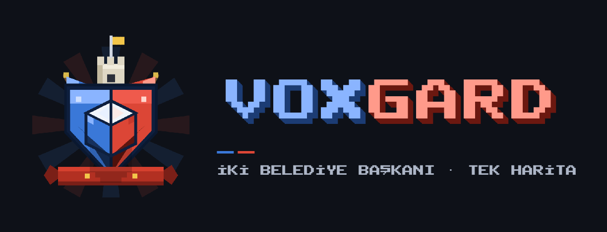

# VoxGard



> **"İki belediye başkanı, tek harita."** — 2 kişilik online şehir kurma + savaş oyunu.

Simetrik bir pixel-art haritanın iki yakasında birer şehir. Üç harita tipi (seed seçer):
**Nehir** (2–3 köprü, doğal cephe hattı), **Göl** (kıyılardan dolaşılır) ve **Ova**
(açık cephe, bol orman). Herkes **Belediye Binası + 1 işçiyle** başlar. Oyun **barışta**
başlar: orta hattaki sınır kapalıdır — birimler geçemez, sınır ötesine inşaat yapılamaz.
**"Savaş İlan Et"** → 30 saniyelik siren → sınırlar açılır, çatışma serbest.

**İki zafer yolu:**

1. **Yıkım Zaferi** — rakibin Belediye Binası'nı yık.
2. **Metropol Zaferi** — 40 nüfus + her bina türünden en az 1 (savaşmadan kazanmak mümkün).

| | |
|---|---|
| Motor | Godot 4.6.3 (GDScript) |
| Ağ | ENet host/join, host-otoriter sim (30 Hz) + 10 Hz snapshot |
| Grafik | Oyuna özel **animasyonlu Asset Bibliası** (WorldBox tarzı, Mavi P1 / Kırmızı P2) — kaynak: [docs/design](docs/design), üreteç: `tools/gen_bible.gd` |
| Font | Public Pixel (CC0, Türkçe karakter desteği tam) |

## Kurulum

```powershell
git clone https://github.com/blackronn/moderncitywar.git
cd moderncitywar
powershell -ExecutionPolicy Bypass -File tools\setup_godot.ps1   # portable Godot 4.6.3 indirir
powershell -ExecutionPolicy Bypass -File tools\godot.ps1 --path . --import   # ilk import
```

Asset'ler repoda hazır (CC0). Yeniden indirmek istersen: `tools\get_assets.ps1`.

## Oynama

Oyunu aç (`tools\godot.ps1 --path .`) — bir oyuncu **Oyun Kur**, diğeri **Oyuna Katıl** + host'un IP'si.

- **Aynı ağda (LAN/yurt/ev):** doğrudan çalışır; host'un lobide görünen IP'sine bağlan.
- **İnternet üzerinden (önerilen): [Tailscale](https://tailscale.com)** — iki tarafa da kur,
  aynı tailnet'e gir, host'un Tailscale IP'sine (100.x.x.x) bağlan. Port açmak gerekmez.
- **Port yönlendirme:** host, modeminden **8910/UDP**'yi kendi makinesine yönlendirir;
  istemci host'un dış IP'sine bağlanır. İlk kurmada Windows Güvenlik Duvarı izni ver
  (veya: `netsh advfirewall firewall add rule name="MCW" dir=in action=allow protocol=UDP localport=8910`).

### Kontroller

| Girdi | İşlev |
|---|---|
| Sol tık / sürükle | Seç / kutu seçim |
| Sağ tık | Bağlamsal: yürü · kaynağa gönder · (savaştayken) saldır |
| İnşa menüsü | İşçi seçiliyken alt panelde; yeşil/kırmızı hayaletle yerleştir |
| WASD / ok / orta tuş | Kamera |
| Tekerlek | Zoom (tam sayı adımlar) |
| ESC | Seçimi / yerleştirmeyi iptal et |

### Birimler ve counter üçgeni

İşçi (toplar/inşa eder; yarım inşaata sağ tıkla devam ettirir) · **Piyade** (ucuz) ·
**Nişancı** (uzun menzil, piyadeye ×2) · **RPG'ci** (zırh/binaya ×2.5, **alan hasarı**) ·
**Tank** (piyadeye ×1.5, etli, **alan hasarı**) · **Sıhhiyeci** (hasarlı dostları iyileştirir).
Piyade yaklaşırsa nişancıyı döver; RPG tankı eritir; tank piyadeyi biçer. Taret savunur.
Sağdaki **ORDU paneli** ile bir türün tüm birimlerini tek tıkla seçersin.

### Ekonomi ve geliştirme

Odun/taş işçiyle; **Sera** yemek, **Banka** para, **Keresteci** odun, **Taş Ocağı** taş
üretir (pasif). Binalar **L3'e kadar geliştirilir** — buton, maliyeti ve kazancı açıkça
yazar: ev +2 nüfus, üretim binaları +%50 hız, taret +5 hasar, kışla/fabrika %15 hızlı eğitim.

## Geliştirme

```powershell
tools\godot.ps1 --headless --path . --script res://tests/run_tests.gd   # birim testleri (+ derleme taraması)
tools\smoke\run_smoke.ps1                       # e2e: tam savas senaryosu (2 headless instance, loopback)
tools\smoke\run_smoke.ps1 -Scenario disconnect  # kopma -> kalan oyuncuya zafer
tools\smoke\run_smoke.ps1 -Scenario metro       # Metropol Zaferi yolu
tools\screenshot.ps1 -Mode demo -OutFile screenshots\demo.png   # gorsel kontrol (menu|preview|demo|end)
tools\godot.ps1 --path . -- --preview            # agsiz tek pencere onizleme
```

Mimari kısa notlar: tüm `@rpc`'ler `scripts/autoload/net.gd`'de yaşar (entity'ler int id ile anılır);
denge sayılarının tamamı `scripts/autoload/defs.gd`'de; harita iki uçta aynı seed'den deterministik
üretilir ve `map_hash` ile el sıkışmada doğrulanır; sim yalnızca host'ta koşar, istemci 10 Hz
snapshot'ı ~150 ms geriden interpolasyonla çizer.

## Yol haritası (MVP sonrası)

Duvar + kapı · ateşkes teklifi · savaş sisi · minimap · sesler · dron keşfi ·
barışta kaynak ticareti · VPS'te dedicated headless server / relay · matchmaking · replay.

## Lisanslar

Kod: MIT. Görseller: oyuna özel Asset Bibliası spriteları (CC0 ruhuna uygun; tasarım
claude.ai/design ile yapıldı, üretici kod `tools/gen_bible.gd`). Repoda duran
[Kenney](https://kenney.nl) paketleri (CC0) artık oyunda kullanılmıyor, referans olarak duruyor.
Font: [Public Pixel](https://ggbot.itch.io/public-pixel-font) (CC0).
